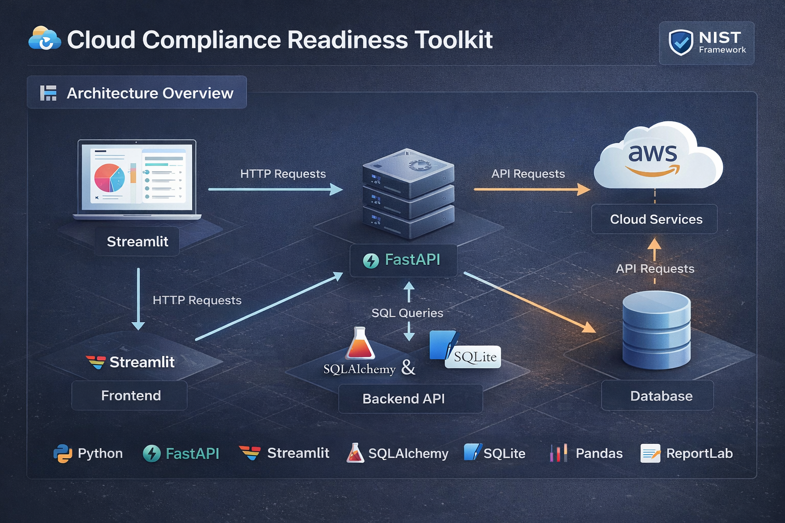
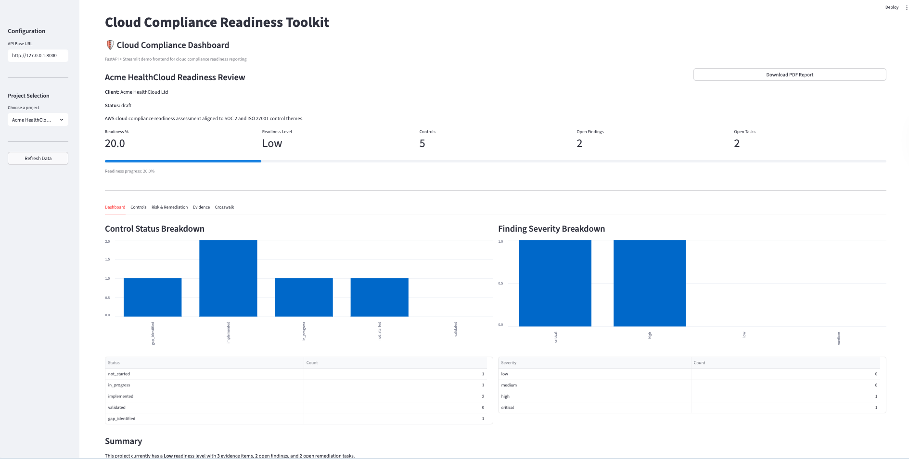
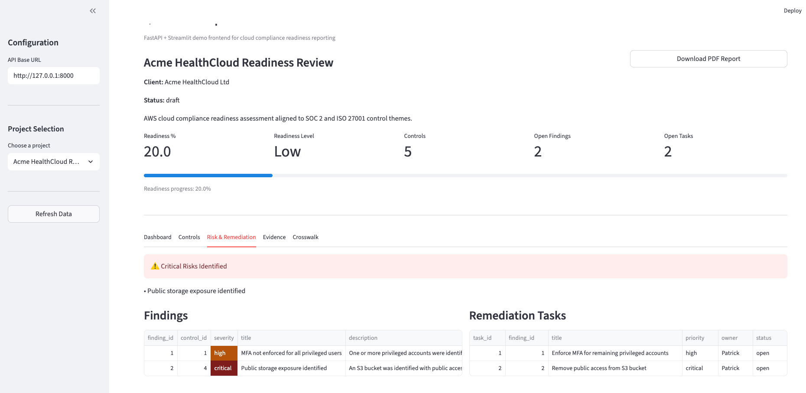
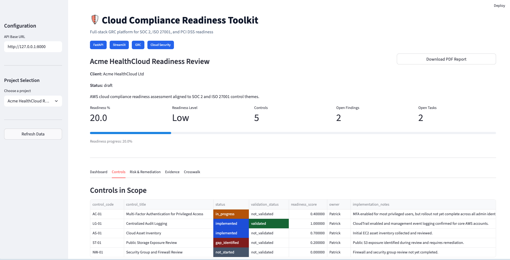
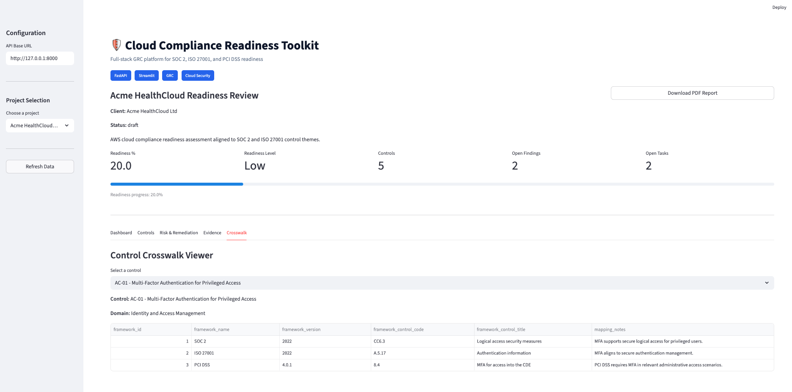
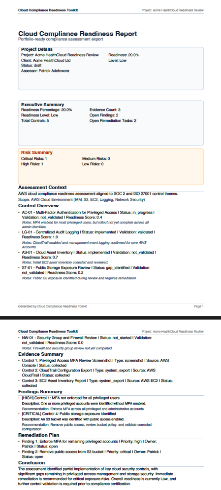

# 🔐 Cloud Compliance Readiness Toolkit

> Simulating real-world cyber assurance and cloud compliance assessments using a full-stack GRC platform across SOC 2, ISO/IEC 27001, and PCI DSS.

A portfolio-ready **FastAPI + Streamlit** application that simulates how organisations assess cloud compliance readiness across frameworks such as **SOC 2, ISO/IEC 27001, and PCI DSS**.

It models real-world cyber assurance workflows, including control assessment, evidence collection, risk identification, and remediation tracking.

---


---
## 🚀 Live Demo

Run locally to explore full functionality:

- **Frontend Dashboard:** http://localhost:8501  
- **API Docs:** http://127.0.0.1:8000/docs  
---

## 🚀 Overview

This toolkit models the full lifecycle of a cloud compliance assessment, including:

- Control implementation tracking  
- Evidence collection  
- Risk identification (findings)  
- Remediation task management  
- Readiness scoring and dashboard reporting  
- Cross-framework control mapping  
- PDF report generation

This project demonstrates practical implementation of **GRC (Governance, Risk & Compliance)** workflows used in real-world cyber assurance engagements.

---
## 💼 Business Value

This project demonstrates how organisations can:

- Identify compliance gaps across cloud environments
- Track control implementation and validation status
- Centralise evidence collection for audits
- Prioritise risks based on severity and impact
- Manage remediation workflows effectively
- Generate executive-ready compliance reports
> This project reflects the type of structured assessments performed by cyber risk, assurance, and GRC teams in regulated environments.

---
## 🧱 Architecture

---
## ❗ Problem Statement

Cloud compliance assessments are often:
- Manual and spreadsheet-driven  
- Difficult to track across multiple frameworks  
- Lacking clear visibility into readiness and risk  

This toolkit provides a structured, API-driven approach to:
- Model control implementation  
- Track evidence and findings  
- Manage remediation workflows  
- Quantify compliance readiness

It bridges the gap between **technical controls** and **business-level risk visibility**.

---

## 🏥 Example Use Case

A healthcare organisation preparing for ISO/IEC 27001 or SOC 2 audit can use this toolkit to:

- Assess cloud security posture (AWS environment)
- Map controls to compliance frameworks
- Identify high-risk gaps (e.g., public S3 exposure)
- Track remediation tasks across teams
- Produce audit-ready reports for stakeholders
---

## ⭐ Key Highlights

- Full-stack GRC platform (backend + frontend + reporting)
- Models real-world compliance workflows (SOC 2, ISO 27001, PCI DSS)
- Demonstrates control lifecycle, risk tracking, and remediation
- Includes dashboard visualisation and PDF export
- Designed to simulate real-world cyber assurance engagements
---

### 🔹 Project-Based Assessments
Create and manage compliance readiness assessments for SaaS or cloud environments.

### 🔹 Control Lifecycle Management
Track controls through:
- Not Started  
- In Progress  
- Implemented  
- Validated  
- Gap Identified

---
### 🔹 Evidence Tracking
Attach and manage audit evidence such as:
- Cloud configuration exports  
- Screenshots  
- System logs  

### 🔹 Findings & Risk Management
Identify and classify risks by severity:
- Low / Medium / High / Critical  

### 🔹 Remediation Workflow
Assign and track remediation tasks with:
- Priority  
- Ownership  
- Status  

### 🔹 Dashboard Reporting
Visualise:
- Readiness percentage  
- Control status breakdown  
- Risk distribution  
- Open remediation workload  

### 🔹 Cross-Framework Mapping
Map controls across:
- SOC 2  
- ISO/IEC 27001  
- PCI DSS  

### 🔹 PDF Report Export
Generate consultant-style readiness reports for stakeholders.

---

## 🖥️ Frontend Dashboard (Streamlit)

Interactive dashboard for:
- Viewing project readiness  
- Monitoring risks and remediation  
- Exploring control mappings  
- Downloading PDF reports  

---

## 🏗️ Tech Stack

| Layer        | Technology |
|-------------|------------|
| Backend API | FastAPI |
| Database    | SQLite + SQLAlchemy |
| Frontend    | Streamlit |
| Reporting   | ReportLab |
| Data Handling | Pandas |
| HTTP Client | Requests |

---

## 📂 Project Structure

```text
cloud-compliance-readiness-toolkit/
├── app/
│   ├── models/
│   ├── routes/
│   ├── services/
│   ├── db.py
│   └── main.py
├── docs/
│   ├── sample-report.pdf
│   └── screenshots/
├── streamlit_app.py
├── requirements.txt
└── README.md
```

---
> Below are real outputs from the toolkit demonstrating compliance tracking, risk identification, and reporting.
## 📸 Screenshots

### Dashboard


---

### Risk & Remediation


---

### Controls View


---

### Crosswalk Mapping


---

### PDF Report


---

## 📄 Sample Report

Download a generated readiness report:

👉 [Download Sample PDF Report](docs/sample-report.pdf)

---
## ⚙️ How to Run

### 1. Install dependencies
```bash
pip install -r requirements.txt
```

### 2. Start FastAPI backend
```bash
uvicorn app.main:app --reload
```

### 3. Launch Streamlit frontend
```bash
streamlit run streamlit_app.py
```
---
## 🎯 Learning Outcomes

This project demonstrates:

- Practical GRC workflow implementation  
- Control-based risk assessment methodology  
- Evidence-driven assurance  
- API-driven architecture design  
- Reporting and stakeholder communication  
---
## 🚀 Future Enhancements
- AWS integration (CloudTrail, IAM, S3 checks)
- Automated evidence ingestion
- Role-based access control (RBAC)
- Multi-project analytics dashboard
- React-based frontend
---
## 🧠 Skills Demonstrated

- Governance, Risk & Compliance (GRC)
- ISO/IEC 27001 & SOC 2 control concepts
- Risk identification and remediation tracking
- API development (FastAPI)
- Data modelling with SQLAlchemy
- Dashboard development (Streamlit)
- Reporting and stakeholder communication
---


## 👤 Author

**Patrick Adefowora**  
Cyber Risk & Assurance Analyst | ISO/IEC 27001 | SOC 2 | Cloud Security  

🔗 LinkedIn: https://www.linkedin.com/in/patrickadefowora/  
📂 GitHub: https://github.com/patrickdad